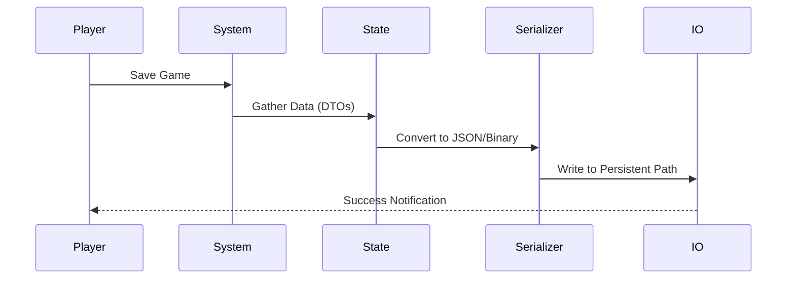

# ⚙️ Save/Load Systems Skill

**Context:** Use this skill when implementing save slots, cloud sync, or global game state persistence.

## 1. Persistence Protocols
- **Data Shape:** Use a dedicated `SaveData` class/struct that is mirrored for serialization.
- **Serialization:** Use `Newtonsoft.Json` for flexibility or `MessagePack` for performance/binary.
- **Paths:** Always use `Application.persistentDataPath` for cross-platform compatibility.

## 2. Implementation Strategy
- **Decoupled Manager:** Create a `SaveLoadManager` that handles the IO. MonoBehaviours should only "Request Save" or "Notify Load".
- **Atomic Writes:** Write to a `.tmp` file first, then replace the original to prevent corruption during crashes.
- **Encryption:** Use simple XOR or AES if you need to prevent casual player editing (though not a substitute for server-side validation).

## 3. Save Flow

## 4. Best Practices
- **Don't save GameObjects:** Save the *properties* (Position, Stats, Inventory IDs) and reconstruct the GameObjects on load.
- **Versioning:** Always include a `version` field in the save file header to handle future migrations.
