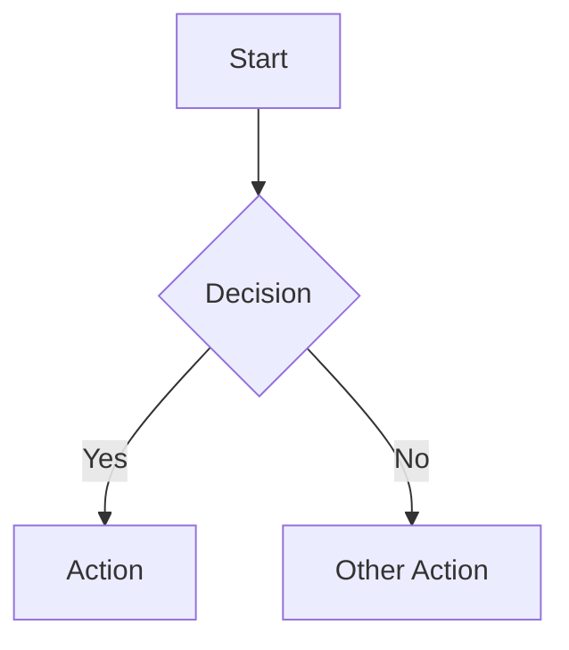
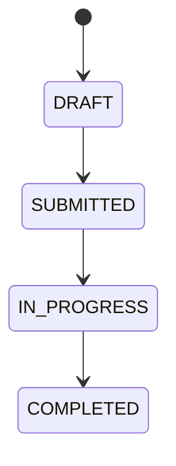
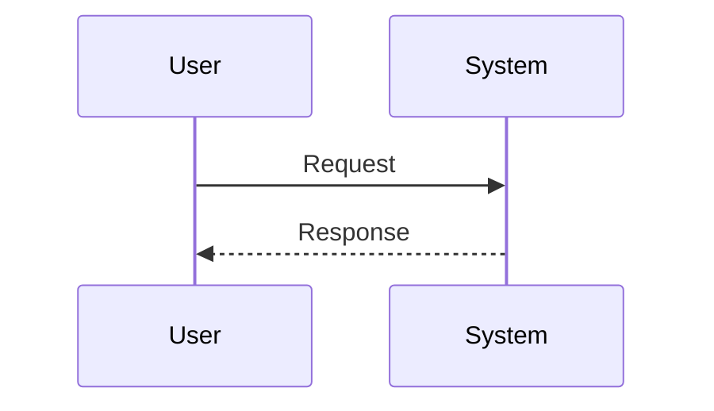

# Documentation Skill

## Overview

This skill covers technical writing best practices, documentation organization, and maintenance strategies for Unity game projects.

## Protocols

| Protocol | When | Reference |
|----------|------|-----------|
| Code-to-Docs Sync | After code changes | `resources/code-sync-protocol.md` |
| Design Sync | Updating mechanics/lore | `resources/gdd-guide.md` |
| Accuracy Protocol | Before any documentation | `resources/accuracy-protocol.md` |

---

## Documentation Categories

| Category | Audience | Purpose | Code Samples? |
|----------|----------|---------|---------------|
| **Player Docs** | End Users | Play the game | ❌ No |
| **Design Docs** | Game Designers | Define mechanics | ❌ No |
| **Technical Docs** | Developers | Build & maintain | ✅ Yes |
| **Project Docs** | Internal Team | Track progress | ❌ No |
| **Release Docs** | All | Track changes | Minimal |

---

## Mandatory Directory Structure

**ALL projects MUST use this structure:**

```
docs/
├── README.md               # Main documentation hub (required)
│
├── guides/                 # Player-facing documentation
│   ├── README.md           # Player docs index
│   ├── tutorials/
│   └── mechanics-overview.md
│
├── design/                 # Game Design (GDD, Lore)
│   ├── README.md           # Design docs index
│   ├── mechanics/          # Combat, UI, Movement
│   ├── lore/               # World, Characters, Script
│   └── economy/            # Progression, Loot
│
├── technical/              # Developer (C#, Prefabs, Shaders)
│   ├── README.md           # Technical docs index
│   ├── architecture/       # System design (ECS vs MonoBehaviour)
│   ├── implementation/     # Component setup, Prefab usage
│   ├── reference/          # API & Scripting docs
│   └── optimization/       # Performance & Profiling
│
├── project/                # Internal team
│   ├── README.md           # Project docs index
│   ├── roadmap.md
│   └── decisions/          # ADRs (Tech & Design)
│
├── releases/               # Version history
│   └── README.md
│
└── archive/                # Deprecated mechanics/lore
```

> **Rule:** When creating new docs, place them in the correct category based on audience.

## Document Structure Standards

### Required Header

Every document MUST have:

```markdown
# Document Title

> **Owner:** [Role] | **Last Updated:** YYYY-MM-DD | **Status:** Active/Draft/Archived
```

### Recommended Sections

1. **Overview** - What is this document about?
2. **Quick Reference** - Key information at a glance
3. **Details** - Full content
4. **Related Documents** - Links to related docs

---

## Writing Guidelines

### For Technical Docs
- Include code samples with C# syntax highlighting
- Document Prefab structures and Component dependencies
- Use Mermaid diagrams for System interaction
- Document the "why" and performance implications

### For Game Design Docs (GDD)
- NO code samples
- Use process flows for state machines or quest logic
- Focus on Mechanics, Balance, and Experience
- Use tables for stat matrices and loot tables
- Include Lore context for systems

### For Player Docs (Guides)
- Use friendly, immersive language
- Include step-by-step tutorials
- Use screenshots/gifs where helpful
- Include Controls/UI reference

---

## Process Flow Standards

### Mermaid Flowchart (Technical)


### State Diagram (Status Flows)


### Sequence Diagram (Interactions)


---

## Documentation Maintenance

### When to Update Docs

| Trigger | Required Updates |
|---------|------------------|
| Code change affecting behavior | Technical + Player docs |
| New mechanic/feature | All relevant categories |
| Bug fix | CHANGELOG only |
| Core System change | Technical docs |
| Design/Balance change | Design docs |

### Quarterly Review Checklist

- [ ] All "Last Updated" dates current
- [ ] No broken internal links
- [ ] Archived outdated content
- [ ] Verified code samples still work
- [ ] Screenshots current

---

## ADR (Architectural Decision Record) Format

```markdown
# ADR-XXX: Decision Title

## Status
✅ Accepted | 🔄 Amended | ❌ Superseded

## Context
Why was this decision needed?

## Decision
What was decided?

## Consequences
- ✅ Positive outcome
- ❌ Negative tradeoff
```

---

## Best Practices

1. **Docs-as-Code**: Documentation lives in Git, reviewed in PRs
2. **Single Source of Truth**: One document per topic
3. **Keep It Current**: Update docs with code changes
4. **Right Audience**: Write for the reader, not yourself
5. **Minimal Viable Docs**: Document what's needed, no more
