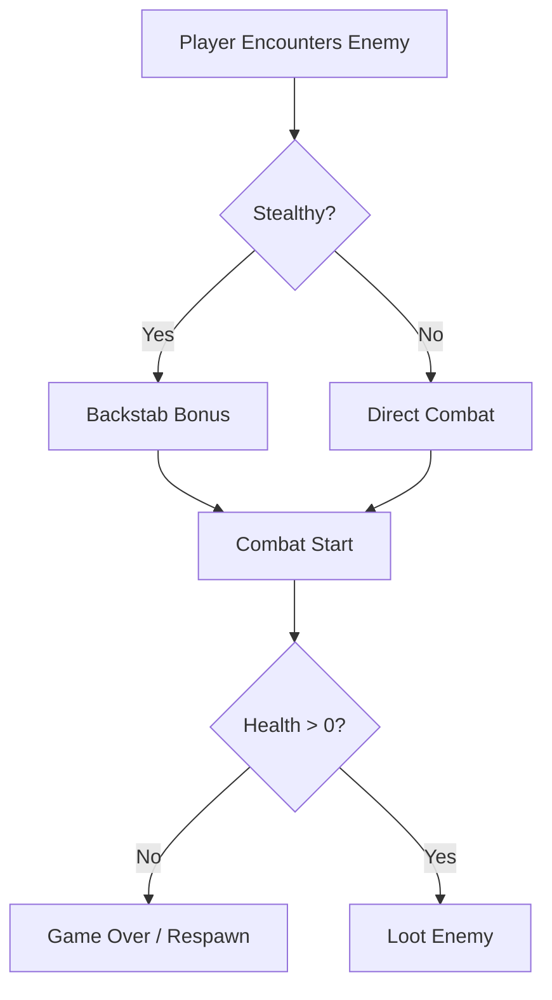
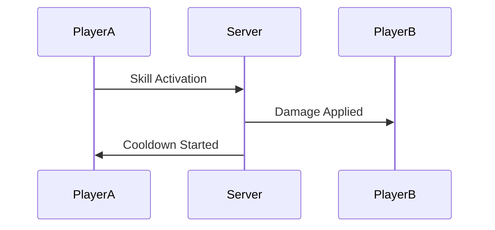
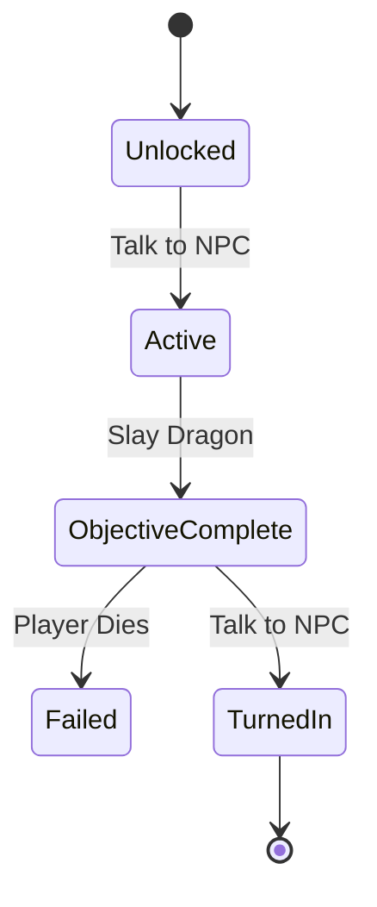

# Game Design Document (GDD) Guide

The GDD is a living document that defines the game's vision, mechanics, and content. It is for **designers, artists, and developers**. Keep it focused on the "What" and "Why", not the implementation code.

## ❌ Golden Rule: NO CODE

GDDs must contain:
- NO C# classes or MonoBehaviours
- NO technical architecture details
- NO implementation snippets
- **Use**: Mechanics descriptions, balance tables, and flow diagrams.

## ✅ Core Document Sections

### 1. High-Level Concept
- **Elevator Pitch**: One sentence that sells the game.
- **Pillars**: 3-4 core values (e.g., "Visceral Combat", "Deep Customization").
- **Core Loop**: The basic cycle of gameplay (Action -> Reward -> Growth).

### 2. Mechanics (`docs/design/mechanics/`)

Use Mermaid diagrams for game states or combat logic:

**Content Requirements:**
- **Control Scheme**: Mapping buttons to actions.
- **Combat/Interaction**: Detailed rules (e.g., "Fireballs ignore 50% physical armor").
- **AI Behavior**: Abstract logic (e.g., "Enemies flee when below 20% HP").

### 3. Lore & World (`docs/design/lore/`)

| Entity | Description | Key Traits |
|--------|-------------|------------|
| Protagonist | Ex-soldier seeking redemption | Agile, Stoic, Scarred |
| The Void | Entropy-based dimension | Consuming, Unstable, Purple |

**Rules:**
- Use evocative, immersive language.
- Define character archetypes, not stat classes yet.
- Include background history and environmental storytelling cues.

### 4. Economy & Progression (`docs/design/economy/`)

| Level | XP Required | Reward | Unlock |
|-------|-------------|--------|--------|
| 1 | 0 | - | Basic Attack |
| 2 | 100 | +5 HP | Dash Ability |

**Rules:**
- Use tables for balancing.
- Define loot rarities and drop rates (abstractly).
- Outline the "Grit" (Difficulty curves).

## Mermaid Tips for Game Design

### Sequence Diagram (Multiplayer interaction)

### State Diagram (Quest Progress)

## Review Checklist for LLMs

Before finalizing a GDD section:
- [ ] NO code snippets (keep it in the GDD, not the TDD).
- [ ] Immersive/Thematic language used.
- [ ] Mechanics are logically sound and balanced.
- [ ] All diagrams are valid Mermaid syntax.
- [ ] Lore is consistent with previously established facts.
